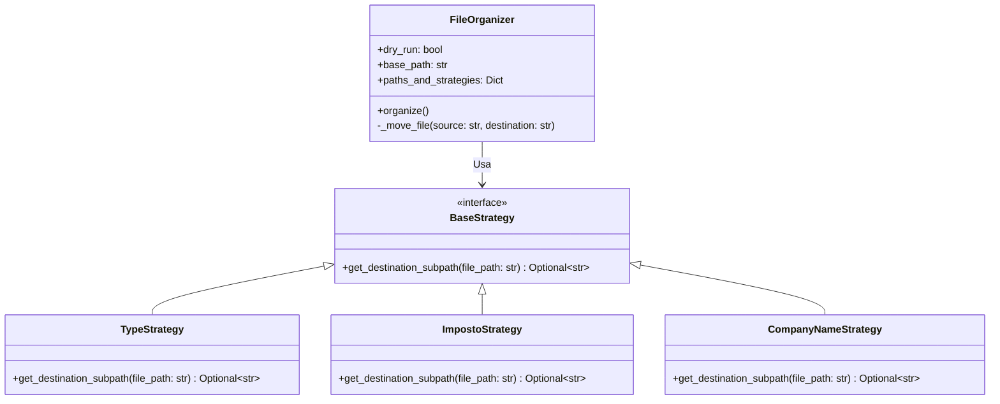

# Organizador Avançado de Arquivos

Uma solução em Python desenvolvida sob princípios SOLID para a organização inteligente de diretórios. O software analisa as extensões dos arquivos, lê o conteúdo de documentos PDF para classificar impostos e extrai metadados estruturados de Notas Fiscais eletrônicas para organizá-los em pastas hierárquicas.

## 🎯 Funcionalidades

*   **Organização por Tipo de Arquivo (`TypeStrategy`):** Agrupa arquivos comuns (como `.png`, `.jpg`, `.mp4`, `.txt`, `.xlsx`) em pastas correspondentes à sua extensão em letras maiúsculas.
*   **Identificação Inteligente de Impostos (`ImpostoStrategy`):** Lê o conteúdo de arquivos PDF buscando palavras-chave como `DARF`, `DAS`, `IPTU`, `IPVA` e `GRERJ`, organizando-os em pastas apropriadas.
*   **Extração de Metadados de Notas Fiscais (`CompanyNameStrategy`):** Identifica e extrai automaticamente o Ano, o Mês e a Razão Social da empresa emitente no conteúdo do PDF para criar pastas estruturadas sob o formato `[Ano] / [Mês] / [Nome da Empresa]`.
*   **Resolução de Conflitos e Duplicados:**
    *   Evita sobrescrever arquivos usando sufixo de timestamp baseado na data de modificação (`mtime`).
    *   Caso haja um arquivo com o mesmo nome de uma pasta de destino a ser criada, o arquivo conflitante é automaticamente renomeado com a tag `_CONFLITO_F_P` para permitir a criação do diretório.
*   **Interface Interativa:** Permite que o usuário insira o caminho da pasta a ser organizada diretamente no console ou por meio de argumentos CLI.

---

## 🛠️ Stack Tecnológica

*   **Linguagem:** Python 3.13+
*   **Leitor de PDFs:** `pdfminer.six` (para extração precisa de textos dos arquivos PDF)
*   **Mecanismo de Resiliência:** `tenacity` (retries automáticos com recuo exponencial para operações de I/O de arquivos)
*   **Compilação:** `PyInstaller` (compila o script em um executável `.exe` único)
*   **Testes:** `pytest`

---

## 🏛️ Arquitetura do Sistema

O projeto segue o padrão **Strategy** (GoF) para desacoplar as regras de organização das rotinas de movimentação de arquivos.



---

## 🚀 Como Executar

Você pode executar o projeto usando o interpretador do Python ou executando diretamente o binário `.exe` na pasta `dist/`.

### 1. Usando os Atalhos Interativos `.bat`
*   **[executar_simulacao.bat](executar_simulacao.bat):** Abre um console interativo no modo **Dry Run** (simulação). Você poderá digitar a pasta de origem; a simulação apenas mostrará quais arquivos seriam movidos e seus respectivos destinos sem realizar nenhuma alteração física.
*   **[executar_real.bat](executar_real.bat):** Abre um console interativo que executa a movimentação **real** dos arquivos do diretório escolhido.

*Nota: Se você pressionar Enter sem digitar nenhum caminho em qualquer um dos scripts, o sistema adotará como padrão o Desktop do usuário (`C:\Users\ANDERSON\Desktop`).*

### 2. Linha de Comando (CLI)
Você pode rodar diretamente o executável via PowerShell ou Prompt de Comando:
```bash
# Simular organização no diretório Downloads
dist\OrganizadorArquivos.exe --path "C:\Users\ANDERSON\Downloads"

# Executar movimentação real no Desktop
dist\OrganizadorArquivos.exe --path "C:\Users\ANDERSON\Desktop" --real
```

---

## 🧪 Como Executar os Testes Unitários

Certifique-se de ter o `pytest` instalado no seu ambiente e rode na raiz do diretório `advanced-organizer`:
```bash
python -m pytest
```
